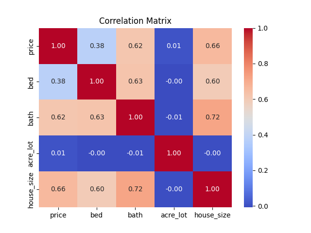

# Multiple Linear Regression
This project uses Linear Regression to predict the price of a house in Minnisota.
### Dataset
The Housing dataset is from [Kaggle](https://www.kaggle.com/datasets/ahmedshahriarsakib/usa-real-estate-dataset).
The dataset contains over 2.2 million real estate listings. 
This project specifically looked at only listings in Minnesota.
There are a variety of parameters in the dataset, however this project only considered the non categorical variables.
- `price` - Float with ether the current listing price or the price the house was recently sold at. Sometimes null if not known.
- `bed` - Float that contains a whole number with the number of bedrooms.
- `bath` - Float that contains a whole number with the number of bathrooms.
- `acre_lot` -  Float that contains land size in acres.
- `house_size` - Float that contains the square feet of living space in the house.

### Correlation Matrix
Using `Correlation_Matrix.py` a correlation matrix was constructed to find the variables that best correlate with the `price`.
`acre_lot` does not have much of a correlation with `price` so it was not used in the regression.
<table>
  <tr>
    <td></td>
  </tr>
</table>

### Linear Regression
Using `Regression.py`, a linear model was fit that has an R^2 of 0.48 and a RMSE of 239148.29. 
Given that this model only uses 3 parameters to predict as something as complex as housing price, I was happy with these results.
