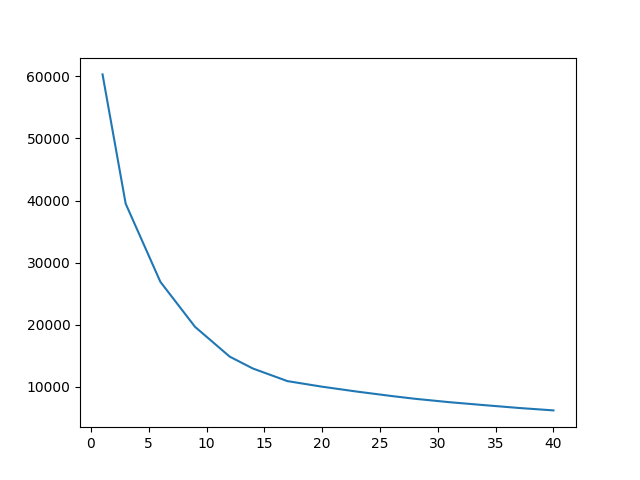
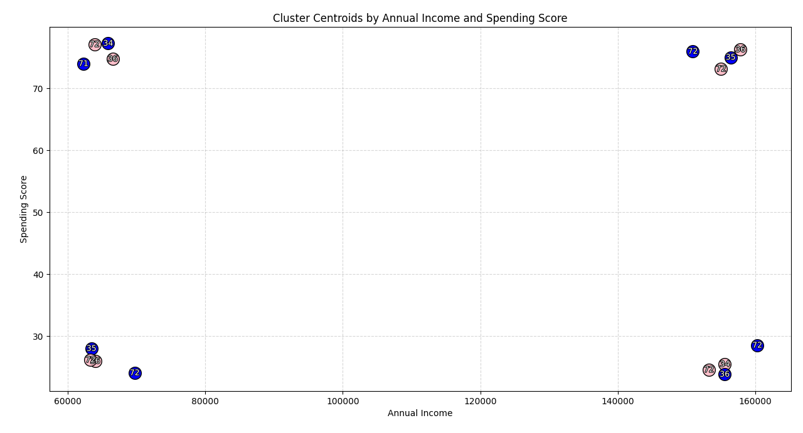

# Shopping trends with K-means clustering
This project uses K-means clustering to spot trends in shopping.
### Dataset
The shopping dataset is from [Kaggle](https://www.kaggle.com/datasets/zubairmustafa/shopping-mall-customer-segmentation-data).
The dataset contains over 15k datapoints and 4 parameters.
- `Age` - integer representing the person's age
- `Gender` - string values of `Male` or `Female`
- `Annual Income` - integer with the annual income in dollars
- `Spending Score` - integer score normalized between 1 and 100 where higher values represent more spending.

### Elbow_Curve
Using `Elbow_Curve.py` a elbow curve was constructed to find the optimal amount of clusters. The curve seems to flatten out at 16 clusters so that was the amount chosen.
<table>
  <tr>
    <td></td>
  </tr>
</table>

### Centroids
K-means clustering found that most shoppers fall into some extreme. They either spend a lot of money or very little money despite how much they make. 
<table>
  <tr>
    <td></td>
  </tr>
</table>
