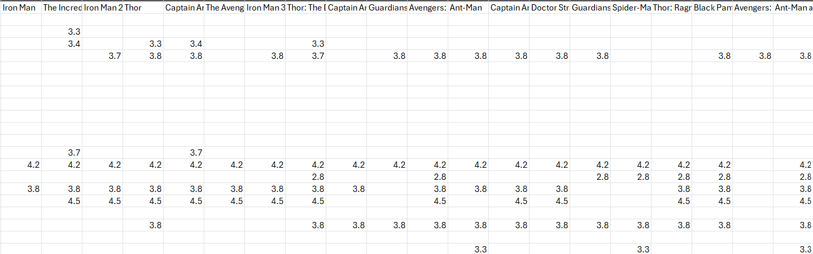
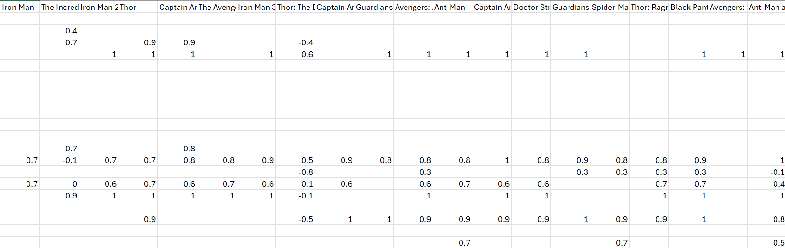

# Collaborative Filtering
This project uses collaborative filtering to predict what movies other students in my machine learning class would like.
### Dataset
The class was survayed and every student wrote down a rating between 1 to 5(inclusive) for every marvel movie they have seen.
This data is recorded in `MovieRecommender.csv`.
The dataset contains 31 students and 35 movies.
If a student had not seen a movie the respective box was left blank.

### Predictions
The inital predictions were made in `No_Normalize.py`.
First a correlation matrix was made to see what movies were enjoyed by the same people.

<table>
  <tr>
    <td></td>
  </tr>
</table>
Then the predictions were made using collaborative filtering. 
The preditions were put in `Recommendations.csv`. 
Every person who already gave a score for a movie was left blank.

<table>
  <tr>
    <td></td>
  </tr>
</table>
The predictions did not very much so to remedy this the data was normalized.

### Centroids
The normalized predictions were made in `Normalize.py`. 
To normalize the data, ratings below 3 were set to -1 and ratings 3 and above were set to 1.
A new correlation matrix was made with the normalized data.
<table>
  <tr>
    <td></td>
  </tr>
</table>

Then the normalized predictions were made using collaborative filtering.
The preditions were put in `Normalized_Recommendations.csv`. 

<table>
  <tr>
    <td></td>
  </tr>
</table>

This made much more diverse predictions.
